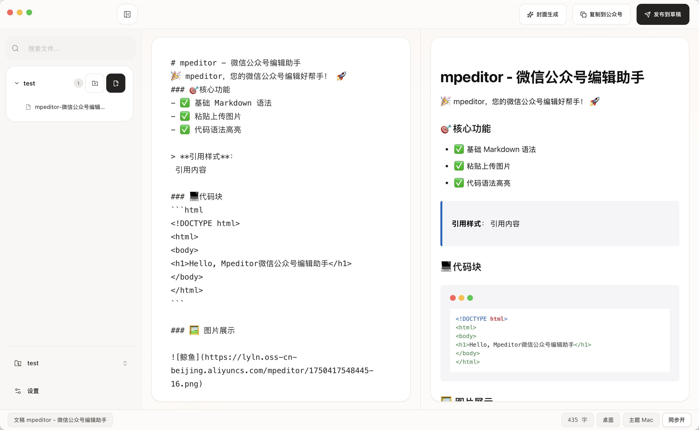

  

<h1 align="center">mpeditor</h1>

  <strong>mpeditor让公众号文章写作、排版和发布更简单</strong>

  写作更顺手，排版更省事，发布更高效。

  <a href="https://mp.inshub.cn">官网</a> •
  <a href="./README.md">English</a>

---

让公众号文章写作、排版和发布准备更简单。

### 核心功能

- 写作更顺手
- 排版更省事
- 发布更高效

你可以把它理解成一个更省心的写作工作台：

- 在里面写文章
- 一边写一边看效果
- 快速切换文章样式
- 直接上传图片
- 复制成更适合公众号的内容
- 直接发送到公众号草稿箱

它面向普通用户设计，不需要你懂代码，也不需要提前掌握复杂的排版知识。

## 预览

## 使用前准备

部分功能需要你提前配置自己的账号信息，例如：

- 公众号草稿发布
- 图片上传
- AI 封面生成（[获取 API Key](https://modelscope.cn/my/access/token)）

### 公众号草稿发布

**公众号转发接口**：使用公众号转发接口时，需要将 [Cloudflare API IP 地址范围](https://www.cloudflare.com/zh-cn/ips/) 添加到微信公众号安全中心的 IP 白名单中。

## 了解更多

- [官网](https://mp.inshub.cn)
- [英文版说明](./README.md)

## 致谢

本项目借鉴或基于以下开源项目：

- [raphael-publish](https://github.com/liuxiaobai-ai/raphael-publish) - 微信公众号发布工具
- [tauri-app-template](https://github.com/kitlib/tauri-app-template) - Tauri 应用模板

## License

[MIT](./LICENSE)
